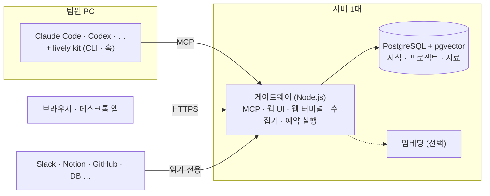

# Lively

**팀과 AI가 같은 업무 맥락 위에서 일하는 에이전트 OS**

[](LICENSING.md)
[](https://github.com/livewithlively/lively/releases/latest)

[English](README.md) · [홈페이지](https://lvly.io) · [매니지드 (app.lvly.io)](https://app.lvly.io) · [아키텍처](docs/architecture.ko.md)

라이블리는 팀의 문서·대화·코드·결정을 AI가 모아 지금 유효한 것만 남긴 맥락으로 쌓고, 팀원 각자가 쓰는 AI(Claude Code, Codex 등)에 필요한 만큼 넣어 줍니다. 그 맥락 위에서 에이전트가 일하고, 팀이 만든 앱도 같은 맥락을 씁니다.

| OS에서는 | 라이블리에서는 |
|---|---|
| 메모리 | **맥락 저장소**: 수집, 중복·폐기 판정, 주입. 세션 결과물은 다시 저장소로 |
| 프로세스·셸 | **작업 공간**: 프로젝트·태스크·세션이 이어지는 흐름. 개발자는 터미널, 나머지는 웹·데스크톱 |
| 앱 | **앱**: 팀이 만든 에이전트·도구가 같은 맥락을 받아 돌아감 |
| 드라이버 | **연동**: Slack, Notion, GitHub, DB 등 |

코어는 AGPL-3.0 오픈소스이고, 인원 제한 없이 무료로 쓸 수 있습니다. 서버를 직접 운영하기 번거롭다면 [매니지드](#직접-운영하기-번거롭다면-매니지드)를 쓰면 됩니다.

---

## 왜 필요한가

팀마다 쓰는 모델은 비슷해졌습니다. 결과의 차이는 AI가 **우리 팀의 일을 아느냐**에서 납니다. 그런데 그 맥락을 관리하는 사람이 없습니다.

- **찾아도 무엇이 맞는지 모릅니다.** 2년 전 스펙과 지난주에 바뀐 결정이 같은 무게로 나오고, AI는 옛것을 읽고 자신 있게 틀립니다.
- **정리해도 곧 낡습니다.** 위키를 만들어도 갱신하는 사람이 없습니다.
- **AI와 한 작업은 세션이 끝나면 사라집니다.** 오늘 한 사람이 AI와 내린 결론을 내일 다른 사람의 AI는 모릅니다.
- **잘 쓰는 사람의 세팅은 그 사람 PC에만 있습니다.** 스킬·훅·MCP 연동을 만든 한두 명만 AI에 일을 맡기고, 나머지는 검색 대용으로 씁니다.

라이블리는 이 관리를 사람 대신 AI에게 맡깁니다.

## 무엇이 들어 있나

### 맥락 저장소

- **수집**: 연결한 도구에서 자료를 읽기 전용으로 가져옵니다. 원본을 그대로 쌓지 않고 사실과 결정만 추려 지식으로 남깁니다.
- **판정**: 같은 내용이 이미 있으면 합치고, 바뀐 결정은 최신으로 대체합니다. 지식마다 출처가 붙습니다.
- **정리**: 조직의 분류체계와 프로젝트에 연결합니다. 임베딩을 켜면 의미 검색도 됩니다.
- **주입**: 세션을 시작하거나 질문할 때 관련 지식을 AI에 넣어 줍니다. 중요한 것만 본문까지 넣고, 나머지는 AI가 필요할 때 MCP로 찾아 읽습니다.
- **회수**: AI가 세션에서 낸 결론은 프로젝트와 지식으로 돌아와 다음 사람의 AI가 씁니다. 중복은 저장 전에 걸러지고, 사람은 나중에 검토합니다.

### 세팅 공유

한 사람이 만든 스킬·훅·서브에이전트·MCP 연동을 조직 자산으로 올리면 모든 팀원의 AI에 자동으로 깔립니다. 전사·팀·개인 단위로 나눠 배포할 수 있고, 새로 온 사람도 첫날부터 같은 환경에서 시작합니다.

### 작업 공간

- **프로젝트·태스크**: 일은 프로젝트와 태스크로 이어지고, AI 세션 하나가 태스크 하나를 맡습니다. 별도 PM 도구 없이 진행 상황과 산출 지식이 한곳에 남습니다.
- **웹 터미널**: 브라우저에서 격리된 AI 세션을 엽니다. 세션이 끝나도 작업 파일은 남습니다. 터미널이 낯선 팀원도 같은 맥락으로 일합니다.
- **내 PC·데스크톱 앱**: 로컬 Claude Code 등에 라이블리를 연결하거나, macOS·Windows·Linux 데스크톱 앱을 씁니다.
- **사내 DB 질의**: 운영 DB 복제본 같은 데이터 소스를 읽기 전용으로 연결하면, 개발팀을 거치지 않고 AI에게 물어 데이터를 봅니다. SQL 방화벽과 테이블 허용·차단 정책이 함께 동작합니다.
- **예약 실행**: 정해 둔 시간에 AI 작업을 돌립니다.
- **Liv**: 처음 설정을 도와주는 AI 도우미입니다. 팀의 자료와 일을 보고 연결할 도구와 설정을 제안하고, 승인하면 적용합니다.

### 앱

팀이 만든 앱(에이전트·도구)을 워크스페이스에 설치하면 조직 맥락과 권한 안에서 돌아갑니다. 앱 설치·권한·SDK는 들어 있고, 다른 조직이 만든 앱을 받아 쓰는 마켓플레이스는 준비 중입니다.

## 다른 선택지와 비교

| | 잘하는 것 | 라이블리와 다른 점 |
|---|---|---|
| **AI 도구의 기본 메모리·규칙 파일** (`CLAUDE.md` 등) | 설치 없이 바로 쓰고, 레포 단위 규칙에 강함 | 사람이 직접 쓰고 고쳐야 하며, 개인·레포 단위에 머묾 |
| **AI 구독형 업무 에이전트** | 이미 쓰는 구독 안에서 설정 없이 시작 | 기억이 개인 단위이고, 세션 결과물이 팀에 쌓이지 않음. 그 벤더의 AI 안에서만 동작 |
| **문서 도구의 AI** | 문서 편집·검색·요약이 뛰어남 | AI가 만든 문서가 검토·중복 정리 없이 쌓임. 코드·DB는 도구 밖 |
| **직접 조립** (메모리 SDK + MCP 서버 + 훅) | 부품을 자유롭게 고르고, 라이선스 비용이 없음 | 수집·판정·권한·화면을 직접 통합하고 계속 운영해야 함 |

라이블리는 이미 쓰는 AI 도구를 바꾸지 않고 그 위에 얹힙니다. 모델이나 도구를 바꿔도 맥락은 라이블리에 남습니다.

**이럴 때는 라이블리가 필요 없을 수 있습니다.**

- 혼자 쓴다. 라이블리의 가치는 여러 사람과 여러 AI가 같은 맥락을 쓸 때 커집니다.
- AI 도구를 하나만 쓰고, 그 도구의 메모리·규칙 파일로 충분하다.
- 직접 조립한 스택을 운영할 플랫폼팀이 있고, 쌓을 지식이 많지 않다.

## 빠른 시작 (셀프호스트)

### 준비물

- **서버 1대**: Ubuntu 24.04 또는 macOS, sudo 권한, 인터넷 연결. 메모리 4GB·디스크 30GB 이상(여럿이 웹 터미널을 동시에 쓰거나 임베딩을 켜면 메모리 8GB 이상). 스크립트가 Docker·스왑·서비스를 설정하므로 전용 서버나 VM을 권합니다.
- **AI 계정**: 팀원 각자의 AI 구독이나 API 키(Claude Code 등). 라이블리는 AI를 되팔지 않습니다.

Docker, Node.js 22, tmux, Claude Code는 설치 스크립트가 깔아 줍니다.

### 설치

```bash
sudo install -d -o "$(id -un)" /opt/lively
curl -fsSL https://github.com/livewithlively/lively/releases/latest/download/lively.tgz | tar -xz -C /opt/lively
cd /opt/lively
PUBLIC_URL=http://<서버 주소>:8080 BOOTSTRAP_ADMIN_EMAIL=you@example.com bash deploy/install.sh
```

스크립트는 저장소(PostgreSQL + pgvector)를 Docker로 띄우고, 게이트웨이를 systemd(Linux)나 launchd(macOS) 서비스로 등록합니다. 끝나면 웹 주소와 첫 관리자 비밀번호를 출력합니다. 새 Ubuntu 24.04 VM 기준으로 몇 분이면 끝납니다.

도메인이 있으면 `PUBLIC_URL` 대신 `LIVELY_DOMAIN=lively.example.com` 을 주세요. HTTPS 인증서를 자동으로 받습니다.

### 첫 설정

1. `http://<서버 주소>:8080/ui/` 에 관리자 계정으로 로그인하고 비밀번호를 바꿉니다.
2. 서버에서 `claude` 에 로그인합니다. 웹 터미널 세션과 자료 정리가 이 계정을 씁니다.
3. 팀원을 초대하고, 각자 자기 PC를 연결합니다. 웹 화면이 안내하는 한 줄을 실행하면 로컬 AI 도구에 라이블리가 연결됩니다.

   ```bash
   curl -fsSL http://<서버 주소>:8080/cli | sh
   # Windows: irm http://<서버 주소>:8080/cli.ps1 | iex
   ```

4. 관리 화면에서 Slack·Notion 같은 수집기를 켭니다. Liv에게 맡기면 대화로 설정을 제안합니다.

상태는 `curl http://<서버 주소>:8080/readyz` 로 확인합니다. 업데이트·백업·임베딩 설정은 [`deploy/README.md`](deploy/README.md)에 있습니다.

## 지원 범위

**AI 도구**: Claude Code(기본), Codex, OpenCode, Antigravity CLI, Grok Build. 어느 도구를 써도 같은 맥락이 주입되고, 공유 세팅이 도구마다 맞는 형식으로 깔립니다.

**수집기**: Slack, Discord, Notion, Google Drive, Gmail, Outlook, GitHub, GitLab, Linear, ClickUp, Figma, 파일 업로드. 목록에 없는 사내 API는 범용 드라이버(HTTP·RSS·웹훅)로 코드 없이 붙입니다. 코드 레포와 사내 DB도 읽기 전용으로 연결합니다.

## 구조



코드 구조와 설계 원칙은 [`docs/architecture.ko.md`](docs/architecture.ko.md), 팀원 PC에 깔리는 kit는 [`kit/README.md`](kit/README.md)를 보세요.

## 보안과 데이터

- **데이터는 설치한 서버에만 저장됩니다.** 지식·자료·대화 기록은 그 서버의 PostgreSQL에 있습니다.
- **AI는 여러분의 계정으로 돕니다.** 팀원의 AI 세션도, 자료 정리도 여러분의 AI 계정·키를 씁니다. 주입된 맥락은 여러분이 고른 AI 제공자에게 전달됩니다.
- **수집은 읽기 전용이고, 허용한 채널만 가져옵니다.**
- **기본 안전장치는 무료 코어에 있습니다.** SQL 방화벽, 테이블 허용·차단, 시크릿 가림, 채널별 읽기·쓰기 가드.
- 컬럼 마스킹, 접근 감사 로그, SSO 같은 기업용 기능은 `src/ee/`에 있고, 운영 환경에서 쓰려면 구독이 필요합니다.

## 실제로 써 본 결과

국내 핀테크 스타트업의 제품 조직이 63일(2026-07-03 ~ 09-03) 동안 썼습니다. 쓸지 말지는 각자 골랐습니다.

| 지표 | 값 |
|---|---|
| 실사용자 | 19명 |
| AI가 라이블리를 부른 횟수(MCP 호출) | 32,797건 |
| 1인당 주간 호출 | 32회 → 619회 (8주) |
| 저장된 지식 중 다시 조회된 비율 | 69% (1,166건 중 806건) |
| 조회 중 저장한 사람이 아닌 팀원의 조회 | 35% |
| DAU/MAU | 61% |

같은 조직의 CTO는 사용자로 시작해 이 레포에 커밋 24건을 기여했습니다. 한 조직의 결과라 일반화에는 한계가 있습니다. 라이블리 팀도 모든 일을 라이블리 위에서 합니다.

## 직접 운영하기 번거롭다면: 매니지드

[app.lvly.io](https://app.lvly.io)는 같은 라이블리를 저희가 운영하는 서비스입니다. 서버 준비·설치·업데이트·백업·장애 대응을 저희가 맡고, 가입하면 워크스페이스가 바로 만들어집니다.

| | 오픈소스 (셀프호스트) | 매니지드 |
|---|---|---|
| 시작 | 서버를 준비하고 설치 스크립트 실행 | 가입하면 바로 |
| 설치·업데이트·백업 | 직접 | 라이블리가 |
| 데이터 위치 | 내 서버 | 라이블리가 운영하는 클라우드 |
| 비용 | 무료, 인원 무제한 | 기본 제공량까지 무료 |
| AI 계정 | 팀원 각자의 계정·키 | 팀원 각자의 계정·키 |

플랜은 아래처럼 나뉩니다. 유료 플랜은 준비 중입니다.

- **무료**: 공유 저장소, 팀 세팅 배포, 기본 연동. 동시 세션 수·저장 용량·세션 시간에 기본 제공량이 있습니다.
- **프리미엄**: 기본 제공량을 넘겨 쓰는 개인·팀. 넘긴 사용량만큼 내고, 상시 실행 에이전트를 씁니다.
- **기업**: 여러 팀과 거버넌스가 필요한 조직. 구성원 권한 관리, 자료 마스킹, 접근 기록, SSO.
- **셀프호스트 지원**: 사내망이나 폐쇄망에 설치하고, 운영을 저희에게 맡기는 계약.

지금은 초대제입니다. [app.lvly.io](https://app.lvly.io)에서 대기자로 등록하면 초대장을 보내 드립니다. 셀프호스트와 매니지드 사이를 옮기고 싶다면 lively@lvly.io로 연락 주세요.

## 라이선스

라이선스는 파일이 있는 디렉터리로 정해집니다.

| 경로 | 라이선스 |
|---|---|
| `kit/`, `desktop/` (팀원 PC에서 도는 코드) | Apache-2.0 |
| `src/ee/` | Lively Enterprise License (운영 환경 사용에 구독 필요) |
| 그 외 전부 | AGPL-3.0-only |

회사 안에서 수정 없이 쓰면 AGPL 때문에 생기는 의무는 없습니다. 수정하거나 외부에 서비스할 때의 조건은 [LICENSING.md](LICENSING.md#frequently-asked)에 정리했습니다.

`src/ee/`는 **선택 사항**입니다. 코어는 이 디렉터리를 정적으로 import 하지 않으므로, 지워도 빌드되고 돌아갑니다.

세 가지를 약속합니다. `kit/`와 `desktop/`은 영구히 Apache-2.0으로 둡니다. 코어를 SSPL·BUSL 같은 비오픈소스 라이선스로 옮기지 않습니다. 무료판은 기본 안전장치와 핵심 가치를 갖춘 완결된 제품으로 유지합니다. 자세한 내용은 [LICENSING.md](LICENSING.md)에 있습니다.

이름은 코드 라이선스가 아니라 [상표 정책](TRADEMARK.md)을 따릅니다. 포크는 자유이고, 이름만 바꿔 주세요.

## 기여

[CONTRIBUTING.md](CONTRIBUTING.md)를 봐 주세요. 기여에는 짧은 [CLA](CLA.md) 서명이 필요하고, 첫 PR에서 봇이 안내합니다.

보안 취약점은 공개 이슈가 아니라 [SECURITY.md](SECURITY.md)의 비공개 경로로 알려 주세요. 그 밖의 문의는 lively@lvly.io로 주세요.

---

Copyright (c) 2026 윤상민 (Sangmin Yoon), 장원준 (Wonjun Jang)
