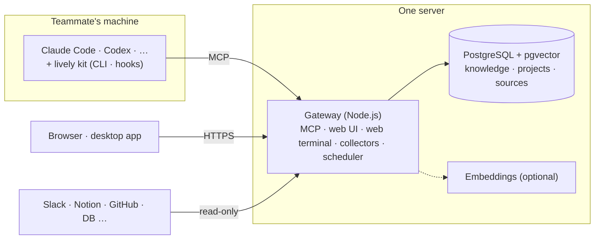

# Lively

**The agent OS where your team and its AI work from the same context.**

[](LICENSING.md)
[](https://github.com/livewithlively/lively/releases/latest)

[한국어](README.ko.md) · [Website](https://lvly.io) · [Managed (app.lvly.io)](https://app.lvly.io) · [Architecture (Korean)](docs/architecture.ko.md)

Lively has AI collect your team's documents, conversations, code, and decisions, keep only what is still true, and feed as much of it as needed to whichever AI each teammate uses (Claude Code, Codex, and others). On top of that context, agents do the work, and the apps your team builds read from the same context.

| In an OS | In Lively |
|---|---|
| Memory | **Context store**: collection, duplicate and outdated-fact checks, injection. Session output flows back into the store |
| Processes & shell | **Workspace**: projects, tasks, and sessions that connect into one flow. Developers use the terminal; everyone else uses the web or desktop app |
| Apps | **Apps**: agents and tools your team builds run on the same context |
| Drivers | **Integrations**: Slack, Notion, GitHub, databases, and more |

The core is open source under AGPL-3.0 and free to use with no limit on team size. If you'd rather not run a server yourself, use the [managed service](#dont-want-to-run-it-yourself-use-the-managed-service).

---

## Why

Teams now use much the same models. The difference in results comes from whether the AI **knows your team's work**. Yet nobody is looking after that context.

- **You find things, but can't tell what's right.** A two-year-old spec and last week's changed decision come back with equal weight, and the AI reads the old one and is confidently wrong.
- **What you organize goes stale.** You build a wiki, and nobody keeps it up to date.
- **Work done with AI disappears when the session ends.** A conclusion one person reached with AI today is unknown to someone else's AI tomorrow.
- **The best setups live on one person's machine.** The one or two people who built skills, hooks, and MCP integrations hand real work to AI; everyone else uses it as a search box.

Lively hands that upkeep to AI instead of a person.

## What's inside

### Context store

- **Collect**: Reads from the tools you connect, read-only. Instead of piling up raw material, it keeps the facts and decisions as knowledge.
- **Judge**: Merges content that already exists and replaces decisions that have changed with the latest version. Every piece of knowledge carries its source.
- **Organize**: Links knowledge to your taxonomy and projects. Turn on embeddings for semantic search.
- **Inject**: Puts relevant knowledge into the AI when a session starts or a question is asked. Only what matters goes in full; the AI looks up the rest over MCP when it needs it.
- **Write back**: Conclusions the AI reaches in a session come back as projects and knowledge for the next person's AI to use. Duplicates are caught before saving, and people review afterwards.

### Shared setup

Promote a skill, hook, subagent, or MCP integration that one person built into an organization asset, and it is installed automatically in every teammate's AI. You can roll it out company-wide, per team, or per person, and new hires start in the same environment on day one.

### Workspace

- **Projects and tasks**: Work flows through projects and tasks, and each AI session takes one task. Progress and the knowledge produced stay in one place, with no separate PM tool.
- **Web terminal**: Open an isolated AI session in the browser. Work files remain after the session ends. Teammates who aren't at home in a terminal work from the same context.
- **Your machine and the desktop app**: Connect Lively to a local Claude Code (or another AI tool), or use the desktop app for macOS, Windows, and Linux.
- **Internal database queries**: Connect a data source such as a production read replica, read-only, and people can ask the AI for data without going through the engineering team. The SQL firewall and table allow/deny policy apply.
- **Scheduled runs**: Run AI jobs at set times.
- **Liv**: An AI assistant for first-time setup. It looks at your team's material and work, proposes which tools to connect and how to configure them, and applies the changes once you approve.

### Apps

Install apps (agents and tools) your team builds into the workspace, and they run inside your organization's context and permissions. App installation, permissions, and the SDK are included; a marketplace for installing apps built by other organizations is in progress.

## How it compares

| | Good at | How Lively differs |
|---|---|---|
| **Built-in memory and rules files in AI tools** (`CLAUDE.md`, etc.) | Works right away with nothing to install; strong for per-repo rules | People have to write and maintain it, and it stays per person or per repo |
| **AI subscription work agents** | Start inside a subscription you already have, with no setup | Memory is per person, and session output doesn't accumulate for the team. Works only inside that vendor's AI |
| **AI in document tools** | Excellent editing, search, and summarization of documents | AI-generated documents pile up without review or dedupe. Code and databases sit outside the tool |
| **Assemble it yourself** (memory SDK + MCP server + hooks) | Free choice of components, no license cost | You integrate collection, judgment, permissions, and UI yourself, and keep operating it |

Lively sits on top of the AI tools you already use, without replacing them. Change models or tools, and the context stays in Lively.

**You may not need Lively if:**

- You work alone. Lively's value grows when several people and several AIs share the same context.
- You use a single AI tool, and its memory and rules files are enough.
- You have a platform team to run a stack you assembled yourself, and not much knowledge to accumulate.

## Quick start (self-hosted)

### Requirements

- **One server**: Ubuntu 24.04 or macOS, with sudo and internet access. At least 4 GB of memory and 30 GB of disk (8 GB of memory or more if several people use the web terminal at once or you turn on embeddings). The script configures Docker, swap, and system services, so a dedicated server or VM is recommended.
- **AI accounts**: Each teammate's own AI subscription or API key (Claude Code, etc.). Lively does not resell AI.

The install script installs Docker, Node.js 22, tmux, and Claude Code for you.

### Install

```bash
sudo install -d -o "$(id -un)" /opt/lively
curl -fsSL https://github.com/livewithlively/lively/releases/latest/download/lively.tgz | tar -xz -C /opt/lively
cd /opt/lively
PUBLIC_URL=http://<server-address>:8080 BOOTSTRAP_ADMIN_EMAIL=you@example.com bash deploy/install.sh
```

The script starts the store (PostgreSQL + pgvector) in Docker and registers the gateway as a systemd (Linux) or launchd (macOS) service. When it finishes, it prints the web address and the first admin password. On a fresh Ubuntu 24.04 VM it takes a few minutes.

If you have a domain, pass `LIVELY_DOMAIN=lively.example.com` instead of `PUBLIC_URL`. An HTTPS certificate is obtained automatically.

### First steps

1. Sign in at `http://<server-address>:8080/ui/` with the admin account and change the password.
2. Log in to `claude` on the server. Web terminal sessions and the organizing of material use this account.
3. Invite teammates, and have each connect their own machine. Running the one line shown in the web UI connects Lively to their local AI tool.

   ```bash
   curl -fsSL http://<server-address>:8080/cli | sh
   # Windows: irm http://<server-address>:8080/cli.ps1 | iex
   ```

4. Turn on collectors such as Slack or Notion in the admin screen. Or leave it to Liv, which proposes a setup through conversation.

Check status with `curl http://<server-address>:8080/readyz`. Updates, backups, and embedding setup are covered in [`deploy/README.md`](deploy/README.md) (Korean).

## What's supported

**AI tools**: Claude Code (default), Codex, OpenCode, Antigravity CLI, Grok Build. Whichever tool you use, the same context is injected, and shared setups are installed in the format each tool expects.

**Collectors**: Slack, Discord, Notion, Google Drive, Gmail, Outlook, GitHub, GitLab, Linear, ClickUp, Figma, and file upload. Internal APIs not on the list connect through the generic driver (HTTP, RSS, webhooks) without writing code. Code repositories and internal databases connect read-only as well.

## Architecture



For code structure and design principles, see [`docs/architecture.ko.md`](docs/architecture.ko.md) (Korean); for the kit installed on teammates' machines, see [`kit/README.md`](kit/README.md).

## Security and data

- **Data is stored only on the server you install.** Knowledge, sources, and conversation history live in that server's PostgreSQL.
- **AI runs on your accounts.** Both teammates' AI sessions and the organizing of material use your own AI accounts and keys. Injected context is sent to the AI provider you choose.
- **Collection is read-only, and only from channels you allow.**
- **Basic safety lives in the free core**: the SQL firewall, table allow/deny policy, secret redaction, and per-channel read/write guards.
- Enterprise features such as column masking, access audit logs, and SSO live in `src/ee/`, and using them in production requires a subscription.

## Results from real use

The product organization of a Korean fintech startup used Lively for 63 days (2026-07-03 to 09-03). Each person chose whether to use it.

| Metric | Value |
|---|---|
| Active users | 19 |
| Times the AI called Lively (MCP calls) | 32,797 |
| Weekly calls per person | 32 → 619 (over 8 weeks) |
| Share of saved knowledge looked up again | 69% (806 of 1,166) |
| Share of lookups by someone other than the author | 35% |
| DAU/MAU | 61% |

That organization's CTO started as a user and contributed 24 commits to this repository. These are results from a single organization, so they generalize only so far. The Lively team also does all of its own work on Lively.

## Don't want to run it yourself? Use the managed service

[app.lvly.io](https://app.lvly.io) is the same Lively, operated by us. We handle the server, installation, updates, backups, and incident response, and your workspace is created as soon as you sign up.

| | Open source (self-hosted) | Managed |
|---|---|---|
| Getting started | Prepare a server and run the install script | Sign up and go |
| Install, updates, backups | You | Lively |
| Where data lives | Your server | Cloud operated by Lively |
| Cost | Free, unlimited users | Free up to the included allowance |
| AI accounts | Each teammate's own account or key | Each teammate's own account or key |

Plans are structured as follows. Paid plans are in preparation.

- **Free**: Shared store, team setup rollout, basic integrations. Concurrent sessions, storage, and session time come with an included allowance.
- **Premium**: For individuals and teams who go beyond the included allowance. Pay for the usage above it, and run always-on agents.
- **Enterprise**: For organizations with multiple teams and governance needs. Member permission management, data masking, access records, SSO.
- **Self-hosted support**: A contract to install on your internal or air-gapped network and have us operate it.

Access is currently by invitation. Join the waitlist at [app.lvly.io](https://app.lvly.io) and we'll send you an invite. To move between self-hosted and managed, contact lively@lvly.io.

## Licensing

The license is determined by the directory a file lives in.

| Path | License |
|---|---|
| `kit/`, `desktop/` (code that runs on teammates' machines) | Apache-2.0 |
| `src/ee/` | Lively Enterprise License (production use requires a subscription) |
| Everything else | AGPL-3.0-only |

Running an unmodified copy inside your company creates no AGPL obligations. The conditions for modifying it or offering it as a service are covered in [LICENSING.md](LICENSING.md#frequently-asked).

`src/ee/` is **optional**. The core never imports it statically, so you can delete it and the project still builds and runs.

We make three commitments. `kit/` and `desktop/` stay Apache-2.0 permanently. We will not move the core to SSPL, BUSL, or any other non-open-source license. The free edition stays a complete product with basic safety and the core value included. Details are in [LICENSING.md](LICENSING.md).

The name follows a [trademark policy](TRADEMARK.md), not the code license. Fork freely; just rename your fork.

## Contributing

See [CONTRIBUTING.md](CONTRIBUTING.md). Contributions require signing a short [CLA](CLA.md); a bot walks you through it on your first pull request.

Please report security vulnerabilities through the private channel in [SECURITY.md](SECURITY.md) rather than a public issue. For anything else, contact lively@lvly.io.

---

Copyright (c) 2026 윤상민 (Sangmin Yoon), 장원준 (Wonjun Jang)
